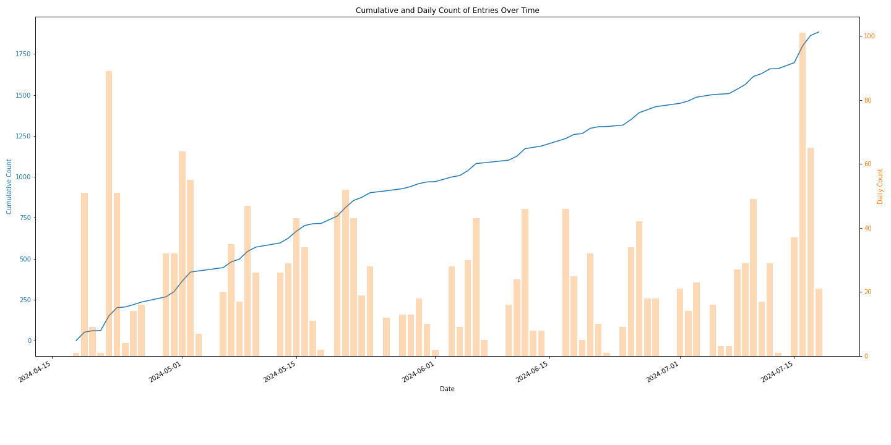
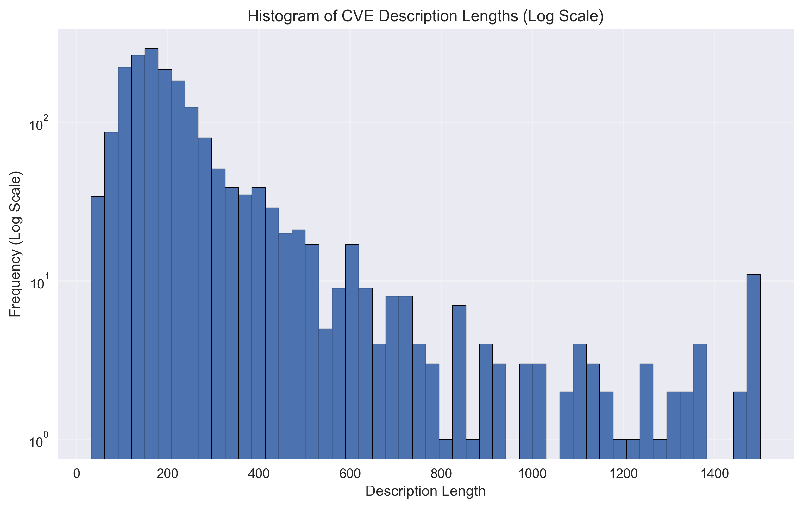

# Recipe
1. [vulnrichment_cwe.ipynb](./vulnrichment_cwe.ipynb): Extract Vulnrichment CWE data to a CSV file with CVE Description, CWE ID
1. [llm_consensus.ipynb](./llm_consensus.ipynb): Ask a consensus of LLMs to review assigned CVE Description, CWE ID

# Plots

### CISA ADP CWE Assignment Plot

### CISA ADP CVE Descriptions Length Plot

