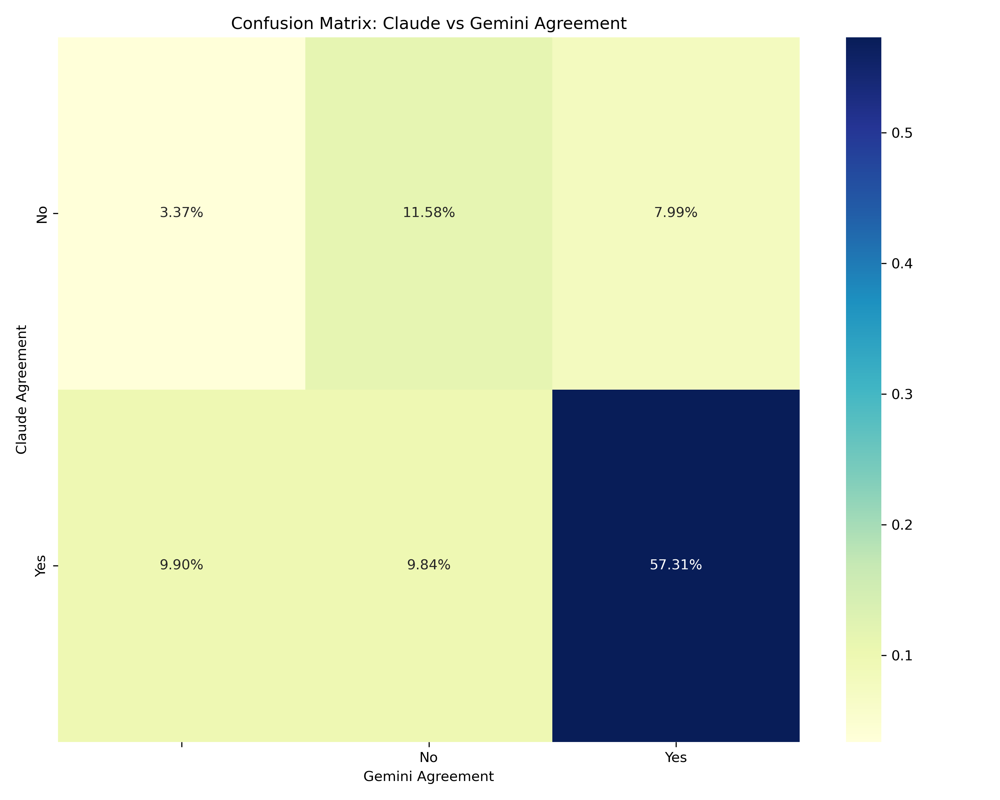

# Overview

Assigning CWEs to CVEs is hard for humans - it requires 
* a technical understanding to know what the root weakness is
* an understanding of [MITRE CWE standard](https://cwe.mitre.org/) to assign the appropriate Common Weakness Enumeration (CWE) to it

There's 2 parts to CWE assignment:

1. Checking existing CWE assignments
2. Proposing CWE assignments
   
See https://cybersecai.github.io/Vulnrichment/Vulnrichment/ for much more details and context.

## Check CWE Assignments
This project uses a consensus of LLMs to check CWEs assigned to CVEs.
* The consensus disagreement subset are then manually reviewed.

It was applied effectively to review all [CISA Vulnrichment](https://github.com/cisagov/vulnrichment/tree/develop) assigned CWEs, and a report was submitted to CISA.

## Propose CWE Assignments
A [solution for augmenting manual assignment of CWEs](https://cybersecai.github.io/Vulnrichment/Vulnrichment/#notebooklm) was used effectively for suggesting CWEs to CVE Descriptions.

# Recipe
1. [vulnrichment_cwe.ipynb](./vulnrichment_cwe.ipynb): Extract Vulnrichment CWE data to a CSV file with CVE Description, CWE ID
1. [llm_consensus.ipynb](./llm_consensus.ipynb): Ask a consensus of LLMs to review assigned CVE Description, CWE ID
1. [chatgpt_batch.ipynb](./chatgpt_batch.ipynb): Ask chatgpt4o in batch mode to review assigned CVE Description, CWE ID
2. [report.ipynb]([./report.ipynb]): Merge the llm_consensus and chatgpt_batch data.

# Output
[llm_consensus CSV file](./data_out/llm_consensus_sorted.csv) contains the responses from the LLMs.

* This is auto-generated and any errors are marked but not resolved.
* This is sorted by Consensus
  * Rows where both models disagree (both "No") will be at the top.
  * These disagreement rows will be sorted by average confidence in descending order.
  * Rows with null or invalid values for agreements or confidences will be placed at the end. These are where there was an error processing the batch.

# Observations
1. The 1800 CVE-CWE pairs consumed 233K tokens in ($0.70), 94K tokens out ($1.41), (based on Claude 3.5 stats https://console.anthropic.com/settings/usage where Output Tokens cost 5 times the cost of Input Tokens per https://console.anthropic.com/settings/plans).

# Plots

### CISA ADP CWE Assignment Plot

### CISA ADP CVE Descriptions Length Plot

### LLM Consensus Confusion Matrix

* Claude Sonnet 3.5 and Gemini 1.5 Pro **both disagreed on 11.58% of CISA ADP assigned CWEs**.
* Claude Sonnet 3.5 and Gemini 1.5 Pro **both agreed on 57.31%  of CISA ADP assigned CWEs**
* The '-' column (i.e. not Yes or No is where there was an error processing the data (I did not root cause this yet).
* Gemini had ~2x more disagreements than Claude
