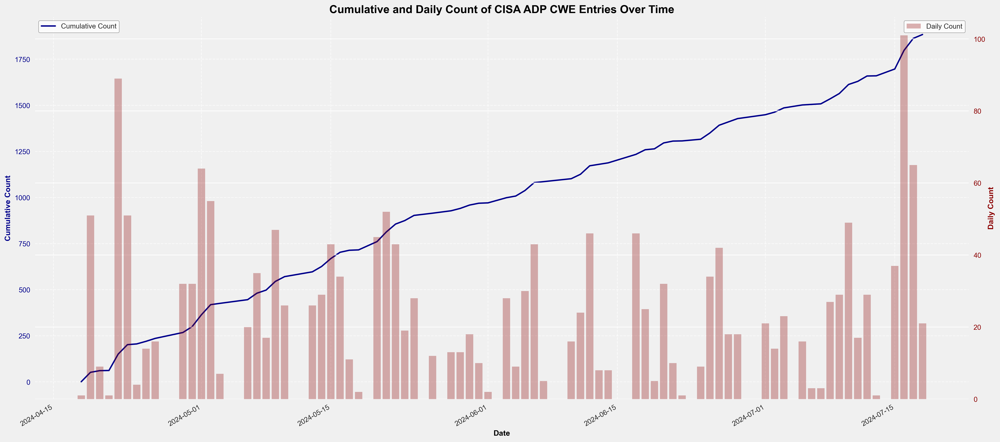
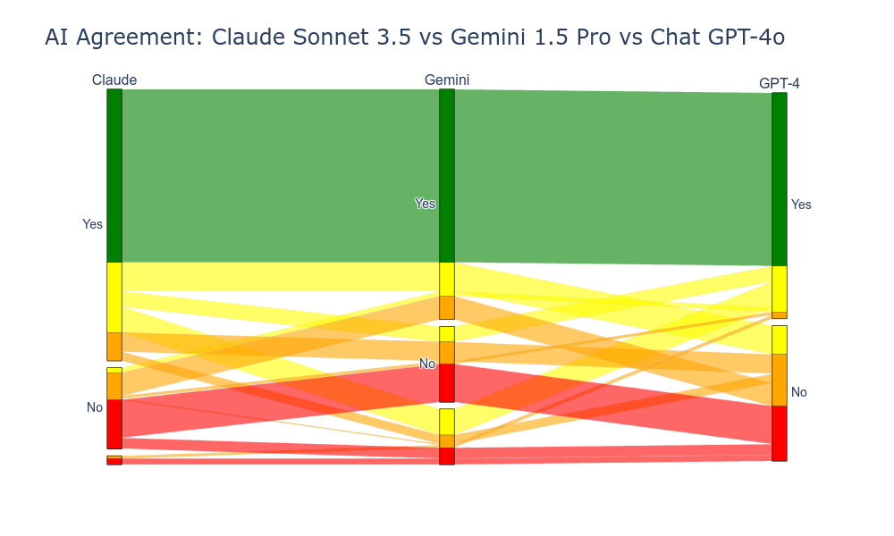

# Overview

Assigning CWEs to CVEs is hard for humans - it requires 
* a technical understanding to know what the root weakness is
* an understanding of [MITRE CWE standard](https://cwe.mitre.org/) to assign the appropriate Common Weakness Enumeration (CWE) to it

There's 2 parts to CWE assignment:

1. Proposing CWE assignments
2. Checking existing CWE assignments

   
See https://cybersecai.github.io/Vulnrichment/Vulnrichment/ for much more details and context.

## Propose CWE Assignments
A [solution for augmenting manual assignment of CWEs](https://cybersecai.github.io/Vulnrichment/Vulnrichment/#notebooklm) was used effectively for suggesting CWEs to CVE Descriptions for CISA Vulnrichment.

This was not a production ready hosted scaled solution.

This project is about productionizing this.

## Check CWE Assignments
This project uses a consensus of LLMs to check CWEs assigned to CVEs.
* The consensus disagreement subset are then manually reviewed.

It was applied effectively to review all [CISA Vulnrichment](https://github.com/cisagov/vulnrichment/tree/develop) assigned CWEs, and a report was submitted to CISA.

# Propose CWE Assignments
See [System Architecture](./system.md).

See [Project Board](https://github.com/orgs/CyberSecAI/projects/2/views/1).

See [Demos](./Demos/).

# Check CWE Assignments
# Recipe
1. [vulnrichment_cwe.ipynb](./vulnrichment_cwe.ipynb): Extract Vulnrichment CWE data to a CSV file with CVE Description, CWE ID
   1. One CVE-CWE pair per line
2. [llm_consensus.ipynb](./llm_consensus.ipynb): Ask a consensus of LLMs to review assigned CVE Description, CWE ID
   1. Output: [llm_consensus CSV file](./data_out/llm_consensus_sorted.csv) contains the responses from the LLMs.
   2. This is auto-generated and any errors are marked but not resolved.
   3. This is sorted by Consensus:
      1. Rows where both models disagree (both "No") will be at the top.
      2. These disagreement rows will be sorted by average confidence in descending order.
      3. Rows with null or invalid values for agreements or confidences will be placed at the end. These are where there was an error processing the batch.
   4. This takes ~10 minutes to run for ~1800 CVE CWE assignments asking 2 LLMs and costs < $5.
3. [chatgpt_batch.ipynb](./chatgpt_batch.ipynb): Ask chatgpt4o in batch mode to review assigned CVE Description, CWE ID
   1. Output: ./data_out/chatgpt_batch.csv with gpt-4o_Agree,gpt-4o_Rationale,gpt-4o_Confidence
4. [report.ipynb]([./report.ipynb]): Merge the llm_consensus and chatgpt_batch data.
   1. Merge the outputs from all 3 models i.e. the 2 output files above
   2. TODO: Sort by consensus
   3. Plot Consensus

# Observations
1. The 1800 CVE-CWE pairs consumed 233K tokens in ($0.70), 94K tokens out ($1.41), (based on Claude 3.5 stats https://console.anthropic.com/settings/usage where Output Tokens cost 5 times the cost of Input Tokens per https://console.anthropic.com/settings/plans).

# Plots

### CISA ADP CWE Assignment Plot

### CISA ADP CVE Descriptions Length Plot

### LLM Consensus Confusion Matrix for Claude Sonnet 3.5, Gemini 1.5 Pro

* Claude Sonnet 3.5 and Gemini 1.5 Pro **both disagreed on 11.58% of CISA ADP assigned CWEs**.
* Claude Sonnet 3.5 and Gemini 1.5 Pro **both agreed on 57.31%  of CISA ADP assigned CWEs**
* The '-' column (i.e. not Yes or No is where there was an error processing the data (I did not root cause this yet).
* Gemini had ~2x more disagreements than Claude

### ParCat Plot for Claude Sonnet 3.5, Gemini 1.5 Pro, ChatGpt4o

This is an interactive version when you run [report.ipynb]([./report.ipynb]) that allows you to hover over the different bands and see the counts.

Value that isn't Yes or No is a missing value (due to errors during processing). 
These are mainly for Gemini.

