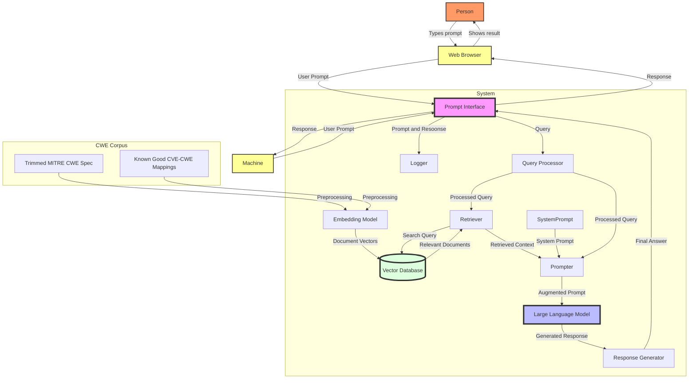

# System Diagram

This is a standard RAG architecture.

1. **CWE Corpus Ingestion** Grounded Closed-System i.e. CWE specification and known good examples are the corpus only.
2. **Logger**: Log of all prompts and responses for feedback and improvement
3. **System Prompt**: Additional instructions to the LLM e.g. Mappings, Confidence, Rationale, Format...
4. Machine or Brower Interface

